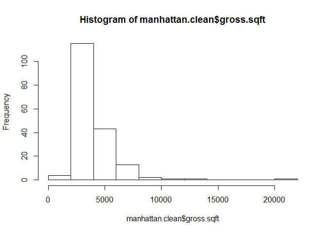
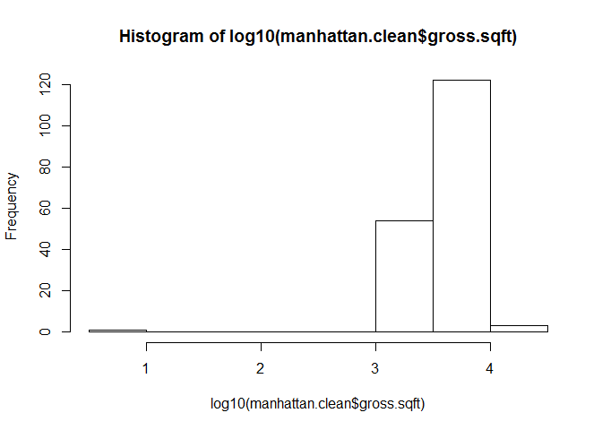
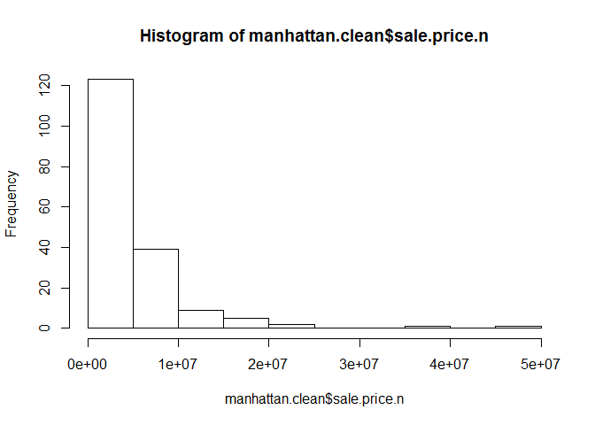
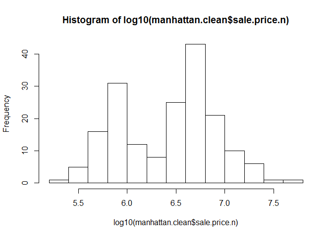
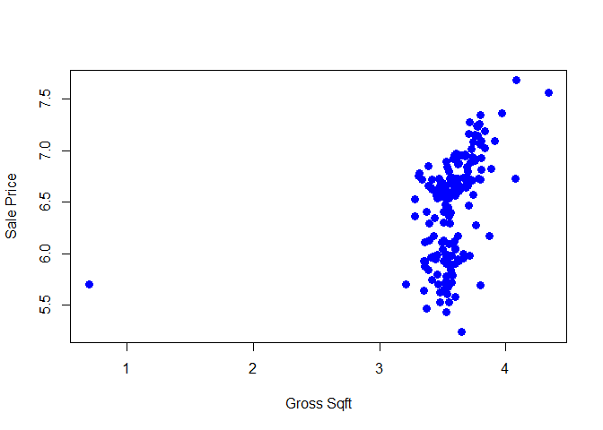
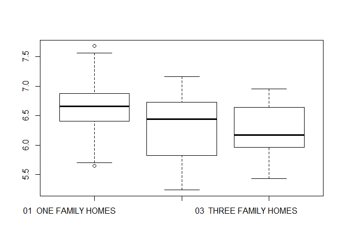

# Manhattan Rolling Data Sales Paper
Kevin Cannon, Vishi Cline, Abhishek Dharwadkar  
October 24, 2016  


# Description:  Markdown analysis on the cleaned datafile for manhattan rolling sales data

Load libraries gdata and plyr:

```r
library(gdata)
```

```
## gdata: read.xls support for 'XLS' (Excel 97-2004) files ENABLED.
```

```
## 
```

```
## gdata: Unable to load perl libaries needed by read.xls()
## gdata: to support 'XLSX' (Excel 2007+) files.
```

```
## 
```

```
## gdata: Run the function 'installXLSXsupport()'
## gdata: to automatically download and install the perl
## gdata: libaries needed to support Excel XLS and XLSX formats.
```

```
## 
## Attaching package: 'gdata'
```

```
## The following object is masked from 'package:stats':
## 
##     nobs
```

```
## The following object is masked from 'package:utils':
## 
##     object.size
```

```
## The following object is masked from 'package:base':
## 
##     startsWith
```

```r
library(plyr)
```

Read the cleaned comma delimited csv file whith header starting at row 1:

```r
manhattan.clean <- read.csv("..\\Data\\2011_manhattan_tidy.csv",header=TRUE)
```

Check what variables are there and the their types:

```r
str(manhattan.clean)
```

```
## 'data.frame':	180 obs. of  26 variables:
##  $ X                             : int  134 135 137 139 140 141 142 1309 1632 2965 ...
##  $ borough                       : int  1 1 1 1 1 1 1 1 1 1 ...
##  $ neighborhood                  : Factor w/ 21 levels "CHELSEA                  ",..: 1 1 1 1 1 1 1 2 3 4 ...
##  $ building.class.category       : Factor w/ 3 levels "01  ONE FAMILY HOMES                        ",..: 1 1 2 2 3 3 3 3 1 1 ...
##  $ tax.class.at.present          : int  1 1 1 1 1 1 1 1 1 1 ...
##  $ block                         : int  719 743 745 772 743 771 772 1054 467 874 ...
##  $ lot                           : int  13 62 61 36 14 61 39 15 54 30 ...
##  $ ease.ment                     : logi  NA NA NA NA NA NA ...
##  $ building.class.at.present     : Factor w/ 11 levels "A4","A5","A7",..: 1 2 5 7 9 9 9 9 4 1 ...
##  $ address                       : Factor w/ 179 levels " 103 HAMILTON PLACE                        ",..: 134 106 111 65 112 80 62 130 63 27 ...
##  $ apartment.number              : int  NA NA NA NA NA NA NA NA NA NA ...
##  $ zip.code                      : int  10011 10011 10011 10011 10011 10011 10011 10036 10003 10003 ...
##  $ residential.units             : int  1 1 2 2 3 3 3 3 1 1 ...
##  $ commercial.units              : int  0 0 0 0 0 0 0 0 0 0 ...
##  $ total.units                   : int  1 1 2 2 3 3 3 3 1 1 ...
##  $ land.square.feet              : Factor w/ 132 levels "1,002","1,011",..: 42 31 95 10 20 109 127 87 11 5 ...
##  $ gross.square.feet             : Factor w/ 156 levels "1,620","1,908",..: 110 54 70 18 50 118 33 61 76 104 ...
##  $ year.built                    : int  1900 1910 1910 1901 1920 1901 1901 1920 1899 1920 ...
##  $ tax.class.at.time.of.sale     : int  1 1 1 1 1 1 1 1 1 1 ...
##  $ building.class.at.time.of.sale: Factor w/ 11 levels " A4 "," A5 ",..: 1 2 5 7 9 9 9 9 4 1 ...
##  $ sale.price                    : Factor w/ 154 levels "$1,000,000","$1,090,000",..: 68 55 108 74 80 69 55 41 33 79 ...
##  $ sale.date                     : Factor w/ 121 levels "2011-01-06","2011-01-11",..: 7 77 30 107 103 19 82 24 119 112 ...
##  $ sale.price.n                  : num  4300000 3850000 6300000 4575000 4800000 ...
##  $ gross.sqft                    : int  4420 3264 3520 2448 3168 4825 2800 3392 3615 4200 ...
##  $ land.sqft                     : int  1646 1518 2057 1267 1397 2469 847 2008 1275 1170 ...
##  $ outliers                      : int  0 0 0 0 0 0 0 0 0 0 ...
```

Explore the clean data with histograms:

```r
hist(manhattan.clean$gross.sqft)
```

<!-- -->

```r
hist(log10(manhattan.clean$gross.sqft))
```

<!-- -->

```r
hist(manhattan.clean$sale.price.n)
```

<!-- -->

```r
hist(log10(manhattan.clean$sale.price.n))
```

<!-- -->

# Meaningful transformation
The original messy data set shows heavily right-skewed data values of both gross square footage and sale price. After a log transformation, the data displays a more normal distrbution, which is ready for further analysis.

***

Explore the data with scatterplots to check the effect of the size of the house on the sale price:

```r
plot(log10(manhattan.clean$gross.sqft),log10(manhattan.clean$sale.price.n), pch = 16, cex = 1.3, col = "blue", xlab = "Gross Sqft", ylab = "Sale Price")
```

<!-- -->

# Meaningful patterns

From the scatterplot of sale price versus gross square footage of the homes, it appears that there is a positive relationship between the two. As the area of the house increases, the sale price of the house increases as well. In fact, the steep positive slope indicates that the price increases quickly with very small increases in overall square footage. This trend is to be expected in a dense area like Manhattan, where space sells for a premium.  

***

We can also explore the data by looking at the boxplots of the sale price by building class category:

```r
boxplot(log10(manhattan.clean$sale.price.n)~manhattan.clean$building.class.category)
```

<!-- -->

# Meaningful patterns

Looking at the sale price of houses in the context of building class, the results are a bit counter intuitive. A three-family home has a lower average sale price than a two-family home, and a two-family home has a lower average sale price than a single-family home. Based on the previous data exploration comparing sale price and square footage, it may be expected that the three-amily home would sell for more since three families likely need more space (and therefore square footage) than a single-family. Here, however, a different factor is accounting for the reversed trend - privacy. Since space is a premium, many people share homes to save money. If a family wants a home to themselves, it costs more to live than to share accommodations. 
